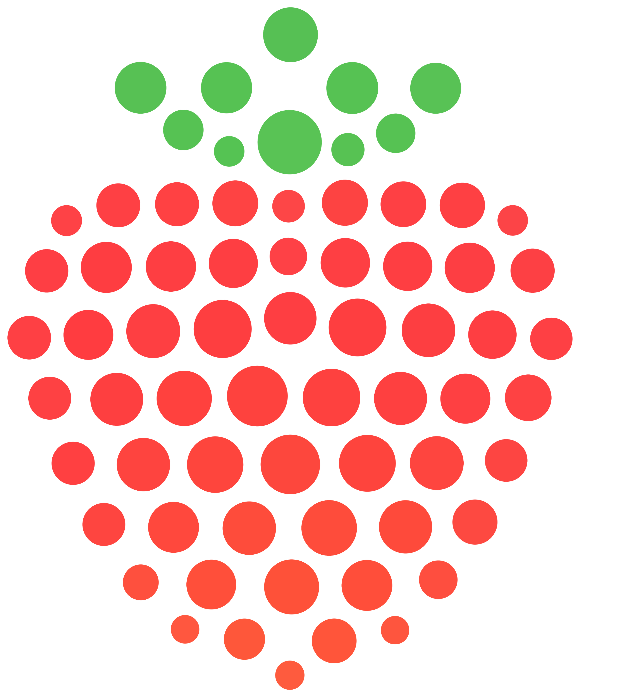

# logo

strawveri brand assets. A dot-grid strawberry icon and wordmark, generated from source.




## build

```
pip install -r requirements.txt
python strawveri_logo.py
python strawveri_wordmark.py
```

Outputs land next to the scripts: `strawveri_icon.png/.svg`, `strawveri_icon_dots.csv`, `strawveri_wordmark.png/.svg`. CI rebuilds them on every push and uploads the results as artifacts.

Poppins Bold is included under the [SIL Open Font License](OFL.txt).
